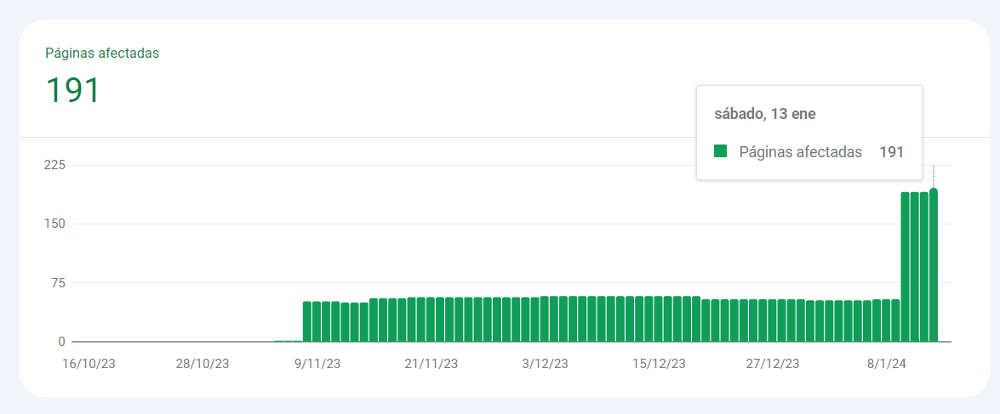
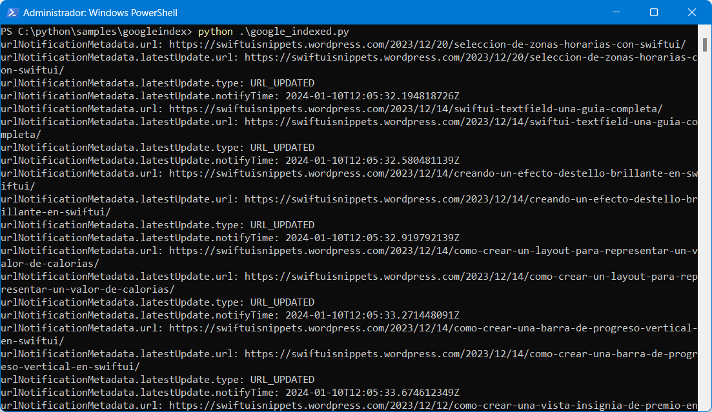

# SiteBoostIndex
Sea indexado por Google y permanezca indexado.

# De donde surge la idea?

El problema del contenido no indexado

Es una situación frustrante cuando creas contenido de alta calidad, pero no se está indexando bien por los motores de búsqueda. Esto puede deberse a una variedad de factores, como la estructura de tu sitio web, la calidad de tu contenido o la frecuencia con la que Google rastrea tu sitio.

En algunos casos, incluso si has hecho todo lo correcto, es posible que tu contenido no se indexe bien simplemente porque Google no lo ha encontrado aún. Esto puede suceder si tu sitio web es nuevo o si tienes un sitio web con un gran volumen de contenido.

**SiteBoostIndex** es un script de python que creé para solucionar mi propio problema. Soy dueño de varias propiedades web con miles de páginas cada una, y se habían estancado en un índice de alrededor del 10% durante un periodo largo.

## Ejemplo
Antes de implementar Site Boost Index, mi indexación se limitaba a las 53 páginas proporcionadas por el archivo sitemap.xml. Después de ejecutar el script de Site Boost Index en todas las URL del sitemap, experimenté un notable aumento, alcanzando 191 páginas en tan solo tres días tras la solicitud de indexación. Este significativo incremento resalta la eficacia de la estrategia mejorada de indexación, proporcionando una visibilidad y accesibilidad sustancialmente mejoradas para todo mi contenido en la web.


🎉 Ahora mis sitios web están indexados al 100% por Google.

## La API de indexación de Google

La API de indexación de Google es una herramienta que permite a los propietarios de sitios web notificar directamente a Google cuando se agregan o eliminan páginas. Esto permite a Google programar páginas para una nueva búsqueda, lo que puede ayudar a que el contenido nuevo o actualizado aparezca más rápidamente en los resultados de búsqueda.

[Guía de inicio rápido de la API Indexing](https://developers.google.com/search/apis/indexing-api/v3/quickstart?hl=es)


## Prerequesitos
 - Tener el sitio web verificado en google search console
 - Tener cuenta a google cloud
 - Crear un proyecto nuevo
 - Habilitar la API Search index
 - Generar credensiales para acceder con api key json
 - Asociar el email de las credenciales al la consola search console de cada sitio a indexar, con permiso propietario

## Script Site Boost Index

Te proporciono mi script de Python, Site Boost Index, para que puedas indexar tus proyectos web simplemente proporcionando las URLs en el archivo urls.csv con el encabezado de campo URL

```csv
URL
https://tupaginaweb.com/pagina1/
https://tupaginaweb.com/otrapagina/
...
```

para correr el script
`python google_indexed.py`



